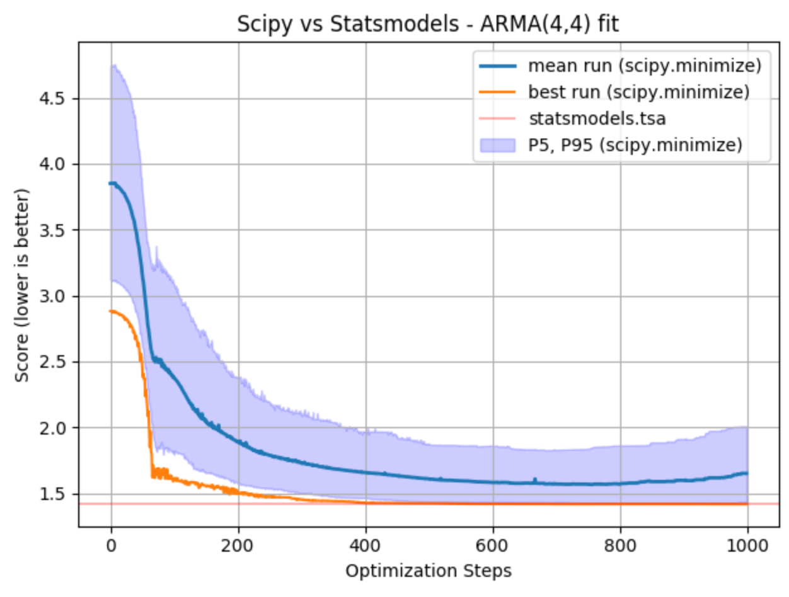

# ARMA w. Scipy
Estimating coefficients of ARMA models with the Scipy package.

## Motivation

ARMA models in general can be, after choosing p and q, fitted by least
squares regression to find the values of the parameters which minimize
the error term. It is generally considered good practice to find the
smallest values of p and q which provide an acceptable fit to the data.
For a pure AR model, the Yule-Walker equations may be used to provide a
fit. "Least squares" means that the overall solution minimizes the sum of the
squares of the residuals made in the results of every single equation.

The reasons behind this Scipy fit implementation are twofold:
- provide an alternative when the score function is not the MSE - **more important**
- provide a way to compare both fit methods (stat theory vs optimization) - less important

You can fit the coefficients of an `ARMA(4,4)` that way:
```bash
python generate_arma_process.py
python scipy_fit_data.py
```

Here is an example of such a fit:
```
################################################################################
Optimization terminated successfully.
         Current function value: 1.432208
         Iterations: 508
         Function evaluations: 788
Estimation of the coefficients with the scipy package:
[ 0.2235 -0.5872  0.3143 -0.1805  0.167  -0.0464  0.6528  0.224 ]
Estimation of the coefficients with the statsmodels.tsa (least squares) package:
[ 0.237  -0.4998  0.3467 -0.128   0.1542 -0.1467  0.6244  0.2245]
True ARMA coefficients:
[ 0.25 -0.5   0.35 -0.15  0.5  -0.4   0.78  0.32]
```

## Comparison

- It is not a surprise that the score function is minimized by the fit of the `statsmodels` package. Indeed, the maximum likelihood estimation is guaranteed to yield the lowest mean squared error score on the train set.
- The Scipy minimize function is doing a relatively good job at being close to this minimum. However, due to the randomness nature of this optimization and the crucial choice of x0 (initial values of the coefficients to optimize), several runs are necessary to guarantee to be close enough to this global minimum. It's clear enough that there is a strong variability across the runs. A significant proportion of runs do not get even closer to this minimum. On 200 runs, the average hovers ~10% above the minimum expected value, then starts to overfit. The best run, however, reaches 1.41807, a score extremely close to the target minimum score of 1.4179.

<p align="center">
  
</p>

The conclusion of this comparison is such that there it makes little sense to fit the coefficients of an ARMA model with a numerical method like `scipy.minimize`. A traditional fit using `statsmodels` is preferable. Yet, `scipy.minimize` could be used if the score function was not the mean squared error. Finding a good x0 is challenging and one way to have a smooth optimization could lie in the estimation of x0 by `statsmodels`. In other words, fit the coefficients with `statsmodels` then optimize with `scipy.minimize` and your custom score function.
